# PES-VCS: Version Control System from Scratch
**Author:** Ujwal Sanikam L  
**SRN:** PES1UG24CS506  

## Project Overview
This project is a custom, lightweight version control system built from scratch in C, mirroring the internal architecture of Git. It implements a content-addressable object store, a staging area (index), and a commit history graph using cryptographic hashing (SHA-256) and atomic filesystem operations.

---

## Phase Implementations

### Phase 1: Object Storage Foundation (`object.c`)
Implemented a content-addressable storage system that saves data as Blobs, Trees, or Commits. 
* **Hashing & Sharding:** Every object is hashed using OpenSSL's SHA-256. The first two characters of the hex hash are used to create a shard directory (e.g., `.pes/objects/2f/`), and the remaining 62 characters form the filename. This prevents filesystem overload in a single directory.
* **Atomic Writes:** To prevent data corruption during system crashes, objects are first written to a temporary file using `mkstemp()` and `fsync()`, then atomically moved to their final location using `rename()`.

### Phase 2: Tree Objects (`tree.c`)
Implemented the hierarchical directory structure.
* **Recursive Parsing:** Built the `tree_from_index` function using a recursive helper function to parse linear paths (e.g., `src/main.c`) from the staging area into a nested tree structure.
* **Memory Management:** Transitioned the parsing logic from stack allocation to heap allocation (`malloc`) to prevent stack overflow (segmentation faults) when handling the large `Index` struct.

### Phase 3: The Index / Staging Area (`index.c`)
Built the preparation area for commits.
* **Metadata Tracking:** The index saves file paths, octal permissions, modification times, sizes, and SHA-256 hashes to a text file (`.pes/index`). 
* **Fast Diffing:** When checking `pes status`, the system uses `stat()` to compare the working directory's modification times and sizes against the index, avoiding the expensive operation of re-hashing unmodified files.

### Phase 4: Commits and History (`commit.c`)
Tied the system together by creating snapshot objects.
* **Commit Creation:** The `commit_create` function builds a root tree from the index, links it to the parent commit via `HEAD`, stamps it with the author's name and UNIX timestamp, and saves it to the object store.
* **Pointer Updates:** Finally, it atomically updates the branch reference file (e.g., `.pes/refs/heads/main`) to point to the newly generated commit hash.

---

## Evidence & Screenshots

### Phase 1: Object Storage
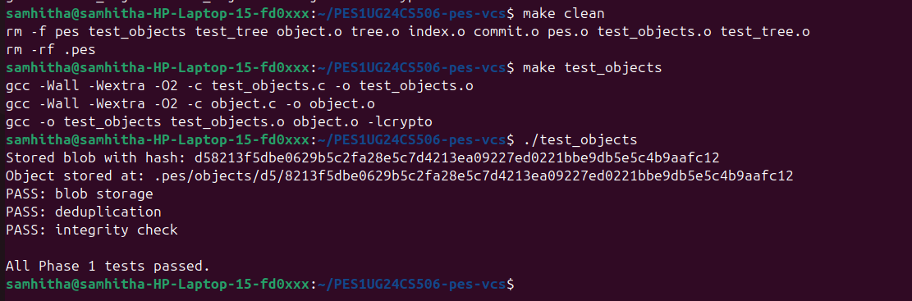
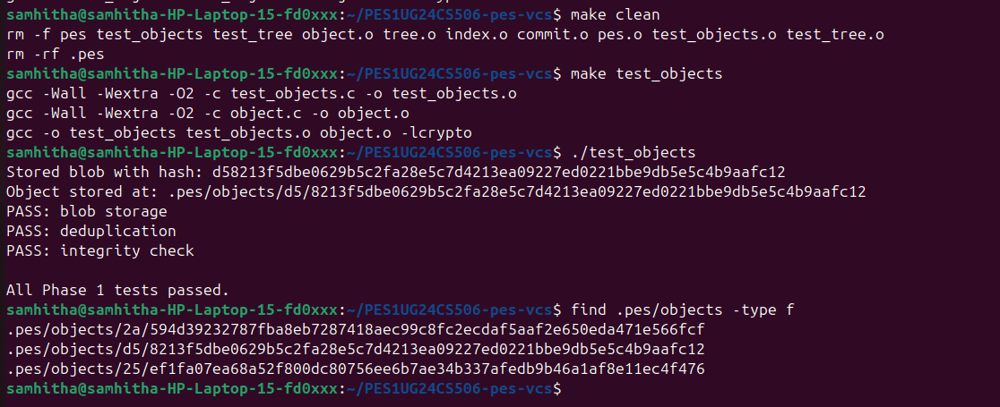

### Phase 2: Tree Objects
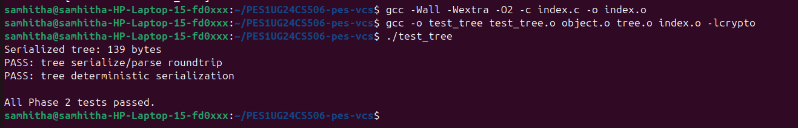
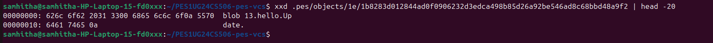

### Phase 3: The Index
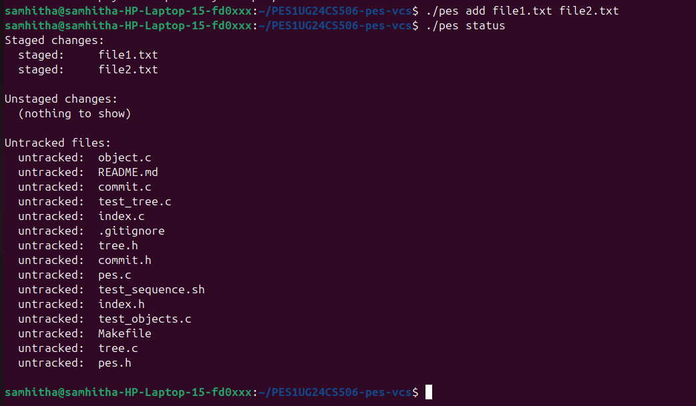
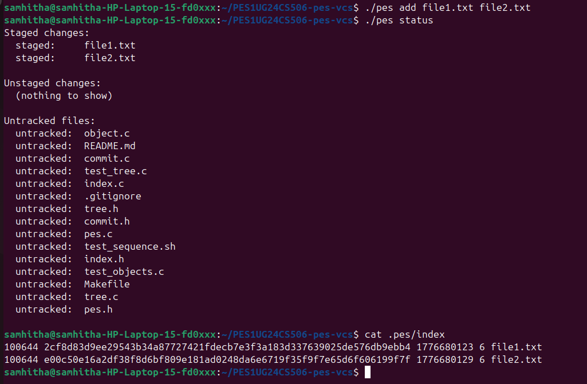

### Phase 4: Commits & History
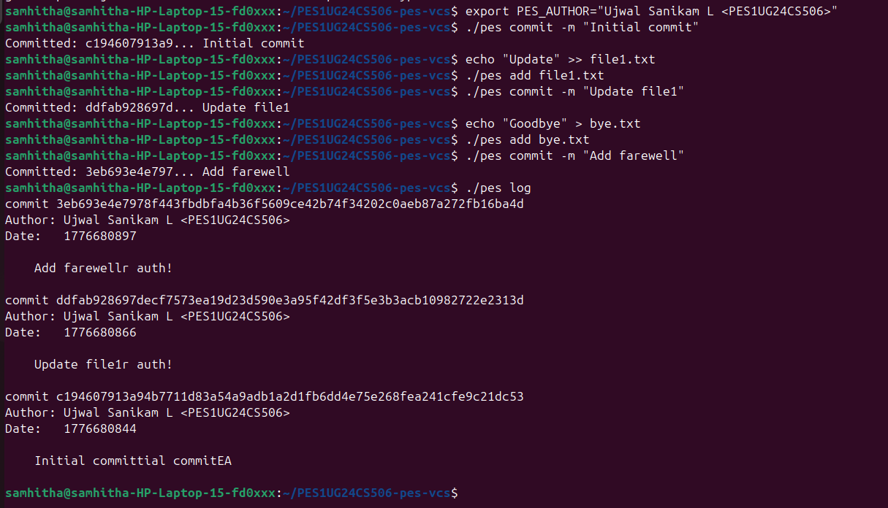
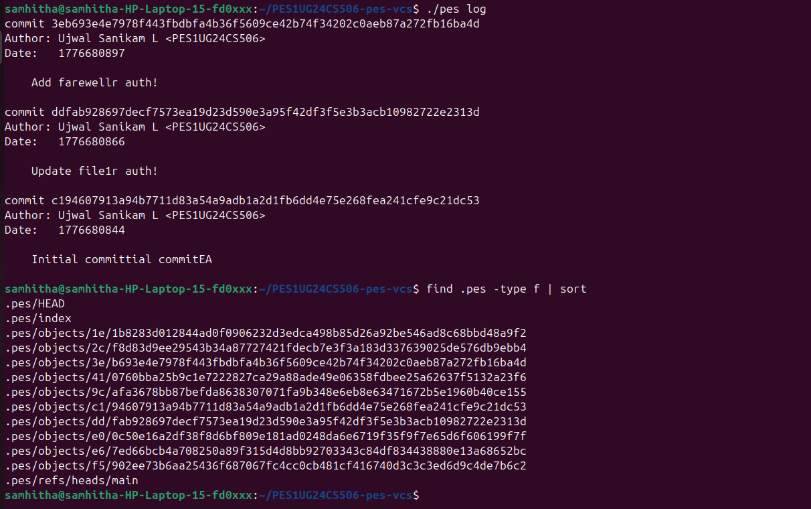
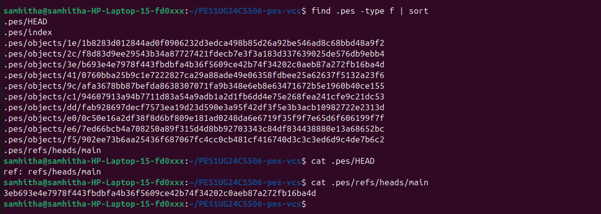

### Final Integration
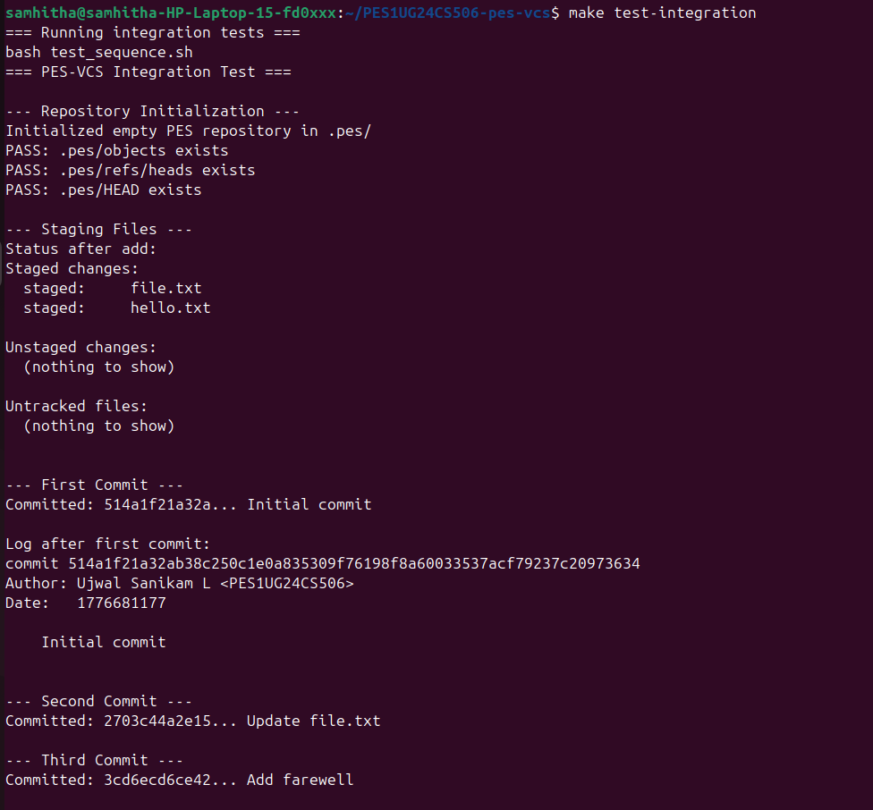
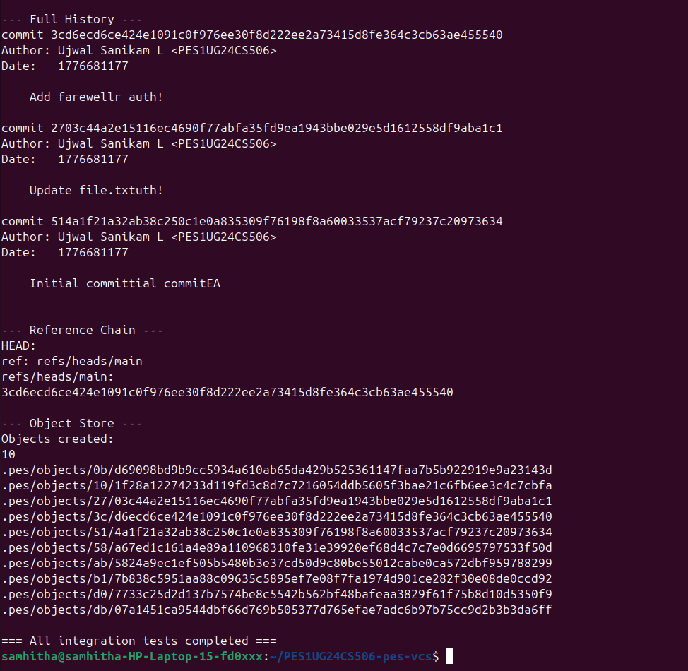

---

## Phase 5: Branching and Checkout Analysis

**Q5.1: How would you implement `pes checkout <branch>`?**
To implement checkout, the system must first read the commit hash stored in the target branch's reference file (`.pes/refs/heads/<branch>`). It then updates the `.pes/HEAD` file to point to this new branch reference. Finally, it must read the target commit's root Tree object, recursively traverse it, and overwrite the files in the user's working directory and the staging area (`.pes/index`) to match the blobs from that snapshot. This is complex because you must ensure you do not overwrite unsaved local changes (dirty working directory) and must clean up untracked files that don't belong in the new branch.

**Q5.2: How would you detect a "dirty working directory" conflict?**
Using the index and the object store, I would compare the target branch's tree with the current `.pes/index`. If a file exists in the current index with modifications (its metadata/hash differs from the last commit) AND the target branch has a different version of that file (different blob hash), a conflict exists. The system must refuse the checkout to prevent permanently overwriting the user's uncommitted work.

**Q5.3: What happens in a "Detached HEAD" state?**
In a detached HEAD state, the `.pes/HEAD` file contains a raw commit hash instead of a branch reference (like `ref: refs/heads/main`). If you make commits, they are created normally and HEAD is updated with the new hash, but no branch pointer moves forward to track them. If you checkout a different branch, those commits become "unreachable" orphans. A user could recover them by finding their hashes (either by searching recent loose objects in `.pes/objects/` or using a feature like Git's `reflog`) and creating a new branch file that points directly to that lost hash.

---

## Phase 6: Garbage Collection Analysis

**Q6.1: Garbage Collection Algorithm**
I would use a "Mark-and-Sweep" algorithm. 
1. **Mark:** Create a Hash Set data structure to store "reachable" hashes. Start at every reference in `.pes/refs/heads/` and `.pes/HEAD`. Read the commit, add its hash to the set, then recursively add the hashes of its parent commits, its Tree objects, and all Blob objects inside those trees.
2. **Sweep:** Traverse the `.pes/objects/` directory. If an object's filename hash is not in the Hash Set, it is unreachable and can be safely deleted using `unlink()`.
*Estimate:* For 100,000 commits, assuming an average of 10 directories and 100 files per commit, you would need to visit and hash-track millions of objects, though deduplication makes the actual set size smaller. A standard Hash Set is highly efficient for this O(1) lookup.

**Q6.2: GC Concurrent Race Condition**
If a user is running `pes add` or `pes commit` at the exact same time GC runs, a race condition occurs. The user's command might create a new Blob object in `.pes/objects/`. Moments later, the GC sweeps the directory. Because the user hasn't finished creating the commit or updating the branch reference yet, the new Blob is technically "unreachable" from any existing branch. The GC will delete it. When the commit finally finishes, it will point to a missing blob, corrupting the repository. 
Git avoids this by giving objects a "grace period." Its GC will only delete unreachable objects if their file modification timestamp is older than a certain threshold (usually 2 weeks), ensuring actively forming commits are completely safe.
